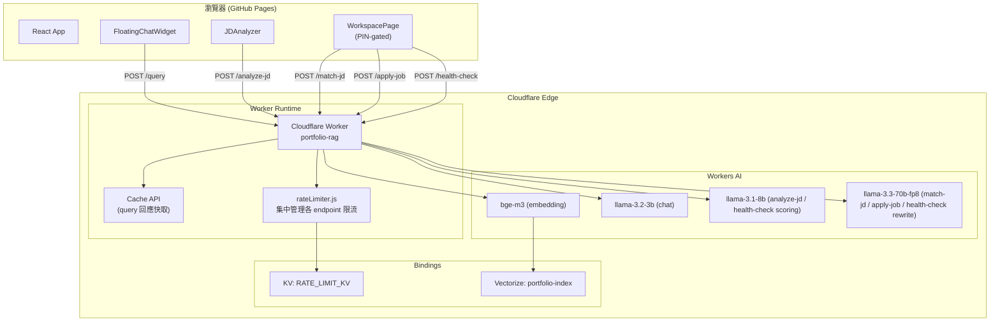
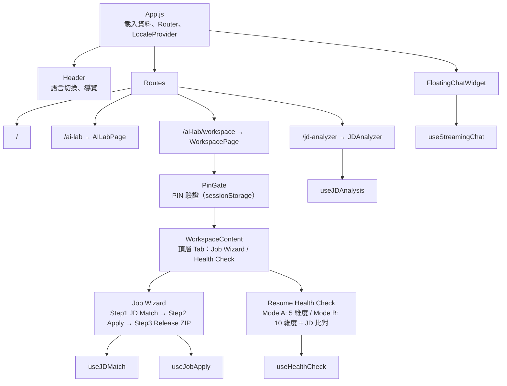
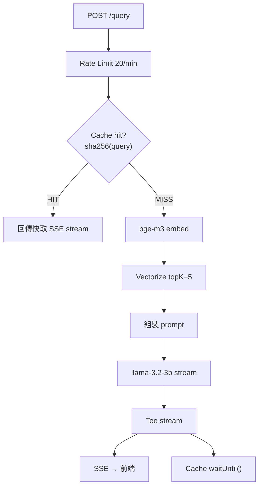
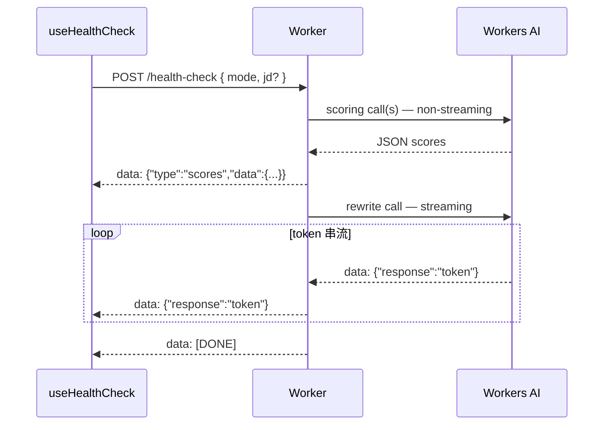
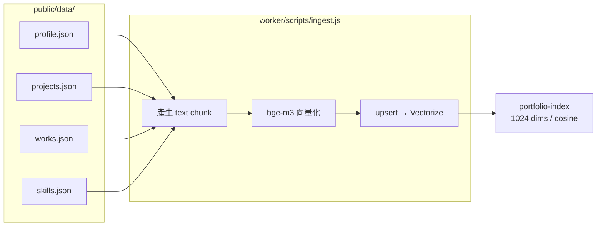

# 系統架構

## 總覽

本專案由兩個獨立部署的元件組成：部署在 GitHub Pages 的 React 靜態網站，以及在 Cloudflare Edge 執行多條 AI pipeline 的 Cloudflare Worker。

---

## Worker Endpoints

| Endpoint | Model | 用途 | Rate Limit |
|----------|-------|------|------------|
| `POST /query` | llama-3.2-3b-instruct | Chat RAG，串流回答 | 20/IP/分鐘 |
| `POST /analyze-jd` | llama-3.1-8b-instruct | JD 契合分析（招募方視角），串流 Markdown | 5/IP/小時 |
| `POST /match-jd` | llama-3.3-70b-fp8-fast | JD 契合分析（求職者自用），串流 Markdown | 10/IP/小時 |
| `POST /apply-job` | llama-3.3-70b-fp8-fast | 客製化履歷 + Cover Letter 生成，串流 | 10/IP/小時 |
| `POST /health-check` | llama-3.1-8b (scoring) + llama-3.3-70b (rewrite) | 履歷量化評分 + 串流改寫建議（雙階段） | 50/IP/小時 |

### Rate Limiter

所有限流邏輯集中於 `worker/src/rateLimiter.js`，各 handler 統一呼叫 `checkRateLimit(kv, ip, RATE_LIMITS.<name>)`。調整限制只需修改 `RATE_LIMITS` 物件，不需改動各 handler。

---

## 前端架構

### 路由

| 路徑 | 元件 | 存取 |
|------|------|------|
| `/` | 主頁（所有 section） | 公開 |
| `/projects` | 專案格狀列表 | 公開 |
| `/projects/:id` | 專案詳情 | 公開 |
| `/works/:id` | 工作詳情 | 公開 |
| `/ai-lab` | AILabPage（AI 工具入口） | 公開 |
| `/jd-analyzer` | JDAnalyzer（招募方使用） | 公開 |
| `/ai-lab/workspace` | WorkspacePage（求職工具箱） | PIN 驗證 |
| `/workspace` | WorkspacePage（同上） | PIN 驗證 |

### 元件樹

### Hooks

| Hook | 對應 Endpoint | 說明 |
|------|-------------|------|
| `useStreamingChat` | `/query` | Chat 串流；history 存 localStorage |
| `useJDAnalysis` | `/analyze-jd` | JD Analyzer 串流 |
| `useJDMatch` | `/match-jd` | Workspace Step 1 串流 |
| `useJobApply` | `/apply-job` | Step 2 串流；以 `<!-- RESUME_START -->` / `<!-- COVER_START -->` 分割兩份文件 |
| `useHealthCheck` | `/health-check` | 雙階段 SSE：先解析 `{type:"scores"}` 事件更新分數面板，後續 token 為串流建議 |

### i18n

`LocaleContext` 提供 `{ locale, setLocale, t }` 給所有元件。語言檔位於 `src/i18n/en.js` 與 `src/i18n/zh.js`。Header 有語言切換按鈕。

---

## 後端架構（Cloudflare Worker）

### /query — Chat RAG Pipeline

### /health-check — 雙階段 SSE

### Prompt 模組

每個 `worker/src/prompts/*.js` 匯出：
- `MODEL` — Cloudflare Workers AI model ID
- `assemble*Prompt(...)` — 組裝完整 prompt 字串

| 檔案 | Model | 用途 |
|------|-------|------|
| `query.js` | llama-3.2-3b-instruct | Chat 問答 |
| `jd-analyzer.js` | llama-3.1-8b-instruct | JD 分析（招募方） |
| `jd-match.js` | llama-3.3-70b-fp8-fast | JD 契合（求職者） |
| `job-apply.js` | llama-3.3-70b-fp8-fast | 履歷 + Cover Letter |
| `resume-eval-base.js` | llama-3.1-8b-instruct | 5 維度 JSON 評分 |
| `resume-eval-jd.js` | llama-3.1-8b-instruct | JD 比對額外 5 維度 JSON 評分 |
| `resume-eval-rewrite.js` | llama-3.3-70b-fp8-fast | 串流改寫建議 |

---

## 資料與 Vectorize

### Ingest Pipeline

> `/health-check` 與 `/apply-job` 不使用 Vectorize，而是直接 fetch GitHub Pages 的 JSON 組裝 candidateData（避免 RAG topK 取樣不完整的問題）。

---

## 部署流程

| 元件 | 平台 | 觸發 |
|------|------|------|
| Frontend | GitHub Pages | push to `main`（GitHub Actions 自動） |
| Worker | Cloudflare Workers | 手動 `wrangler deploy` |
| Vectorize 資料 | Cloudflare Vectorize | 手動 `node scripts/ingest.js` |

### 環境變數

| 變數 | 使用位置 | 用途 |
|------|---------|------|
| `REACT_APP_WORKER_URL` | GitHub Secret + `.env` | Worker URL，build 時注入 React |
| `CLOUDFLARE_API_TOKEN` | 本機 shell | ingest.js — 向量化 + upsert |
| `CLOUDFLARE_ACCOUNT_ID` | 本機 shell | ingest.js — Cloudflare REST API |

---

## 關鍵設計決策

**多模型分層策略** — 依任務複雜度選用不同大小的模型：短對話用 3B 省成本、結構化分析用 8B、長文件生成用 70B 保品質。

**集中化 Rate Limiter** — 所有限流邏輯收斂至 `rateLimiter.js`，調整限制不需修改各 handler，也不容易遺漏。

**健檢雙階段 SSE** — `/health-check` 先送一個 `{type:"scores"}` 事件讓前端立即渲染分數面板，再串流改寫建議；前端不需輪詢，體驗與純串流相同。

**PinGate** — Workspace 頁面以 PIN 保護，PIN 驗證後存 `sessionStorage`，不需後端 session；適合個人工具不引入額外基礎設施。

**SSE 而非 WebSocket** — LLM token 串流只需伺服器→客戶端單向推送，SSE 透過標準 `fetch()` + `ReadableStream` 即可使用。

**Stream tee 快取（/query）** — LLM stream tee 成兩份：一份即時回傳，另一份 `waitUntil()` 背景寫入 Cache API，不增加首次回應延遲。
