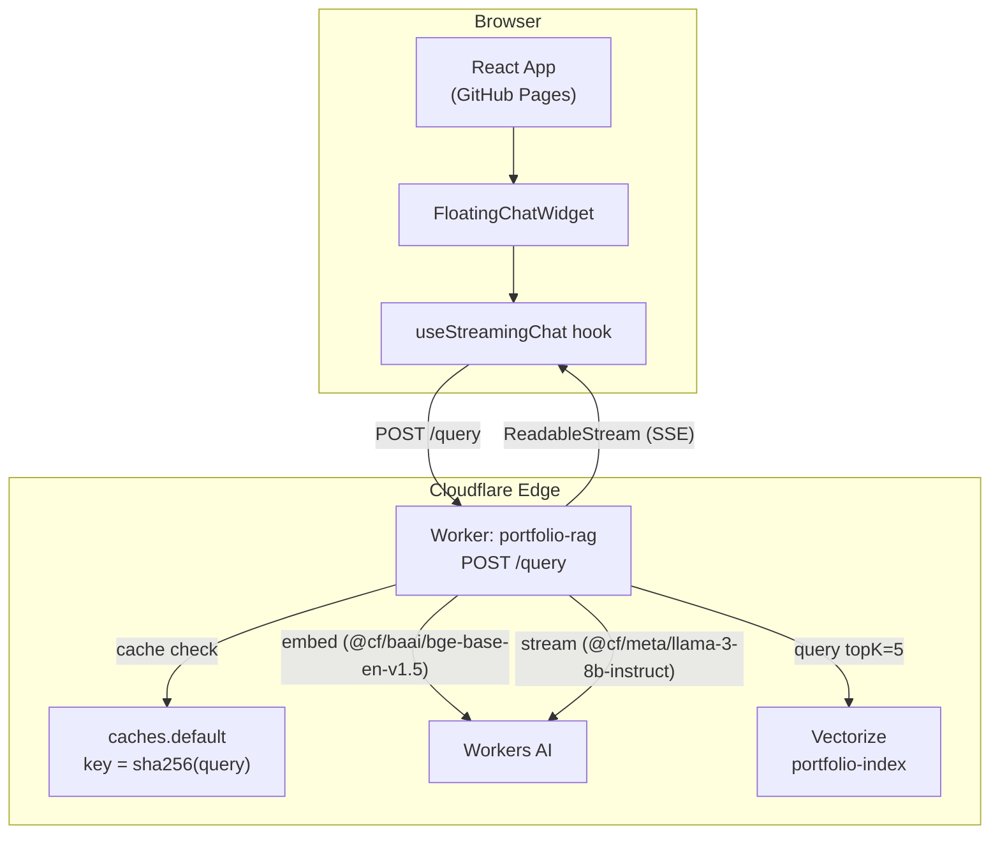
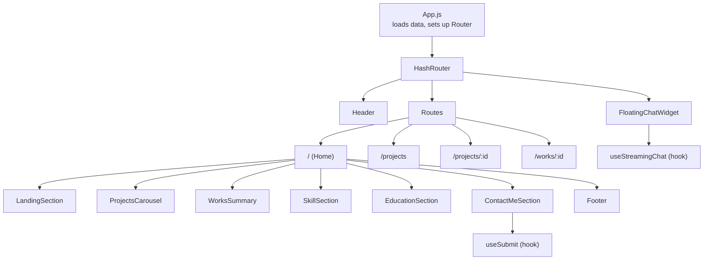
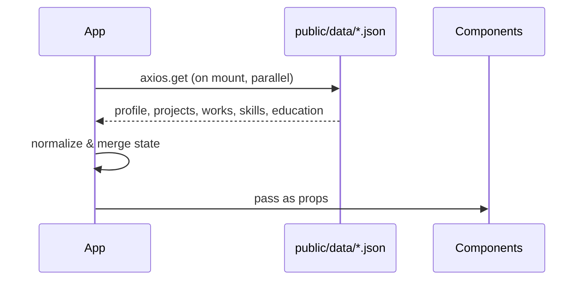
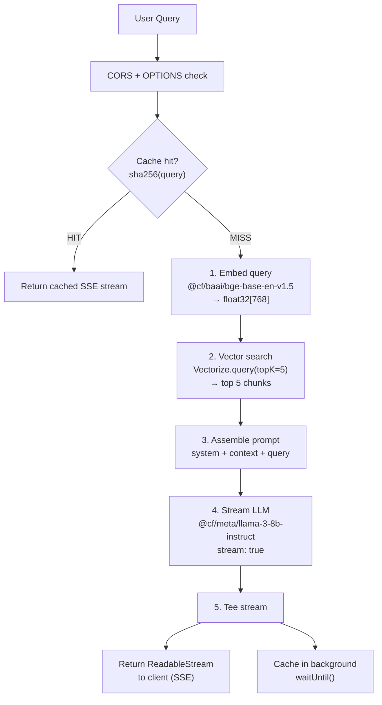
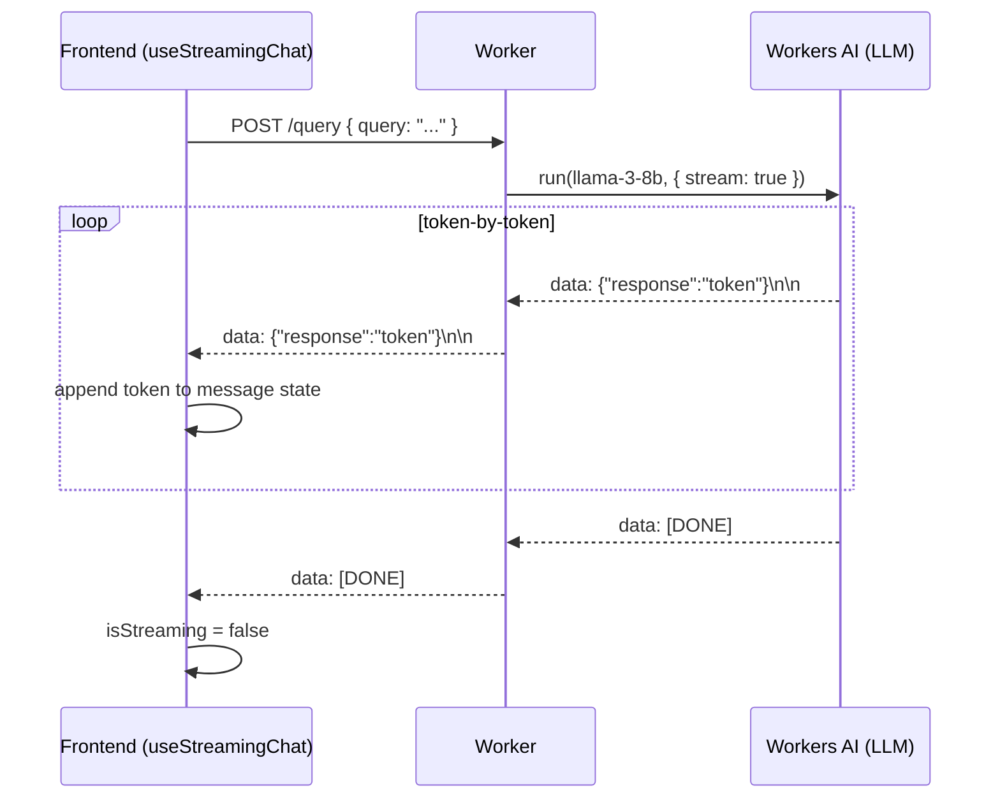
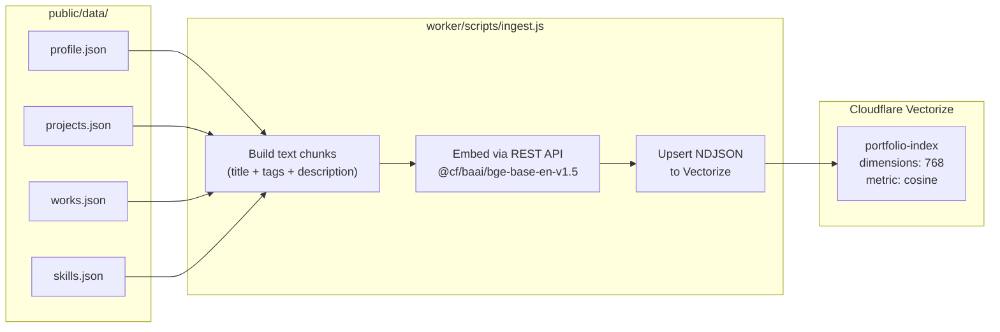
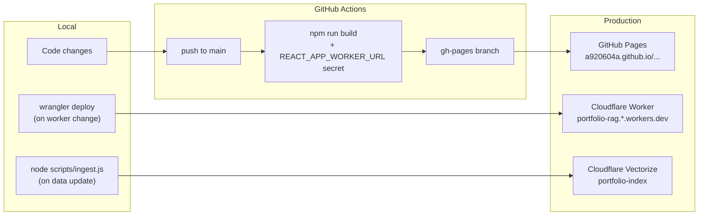

# Architecture

## System Overview

Two independently deployed components: a React static site on GitHub Pages and a Cloudflare Worker handling RAG + LLM streaming at the edge.

---

## Frontend Architecture

### Component Tree

### Data Flow

### Routing

Uses `HashRouter` (`/#/`-based) — works on GitHub Pages without server-side config.

| Path | Component |
|------|-----------|
| `/` | Main landing page |
| `/projects` | All projects grid |
| `/projects/:id` | Project detail |
| `/works/:id` | Work experience detail |

---

## Backend Architecture (Cloudflare Worker)

### RAG Pipeline

### Streaming Protocol

---

## Data & Vectorize

### Ingest Pipeline (one-time / on data update)

### Vector ID Convention

| Source | Vector ID |
|--------|-----------|
| `projects.json` item | `project-{id}` |
| `works.json` item | `work-{id}` |
| `skills.json` | `skills` |
| `profile.json` | `profile` |

Each vector stores metadata `{ text, type }` for context extraction at query time.

See [RAG_SYNC_GUIDE.md](./RAG_SYNC_GUIDE.md) for the full sync workflow.

---

## Deployment

### Environment Variables

| Variable | Used By | Purpose |
|----------|---------|---------|
| `REACT_APP_WORKER_URL` | GitHub Secret + `.env` | Worker URL baked into React build |
| `CLOUDFLARE_API_TOKEN` | Local shell | ingest.js — embed + upsert to Vectorize |
| `CLOUDFLARE_ACCOUNT_ID` | Local shell | ingest.js — REST API calls |

---

## Key Design Decisions

**HashRouter over BrowserRouter** — GitHub Pages serves a single HTML file; hash-based routing avoids 404s on direct URL access without server config.

**Cloudflare Workers over a traditional server** — Zero cold-start latency, globally distributed edge execution, co-located with Vectorize and Workers AI to minimize embed + search roundtrip.

**SSE over WebSocket** — One-way LLM token streaming only needs server→client push; SSE is HTTP-native and works with standard `fetch()` + `ReadableStream` without extra protocol overhead.

**Stream tee for caching** — The LLM stream is tee'd so the client receives tokens immediately while the full response is stored in `caches.default` in the background — no added latency on cache miss.

**`public/data/*.json` as single source of truth** — The same JSON files drive both the portfolio UI and the RAG knowledge base, eliminating any content duplication or sync drift between UI and AI.
