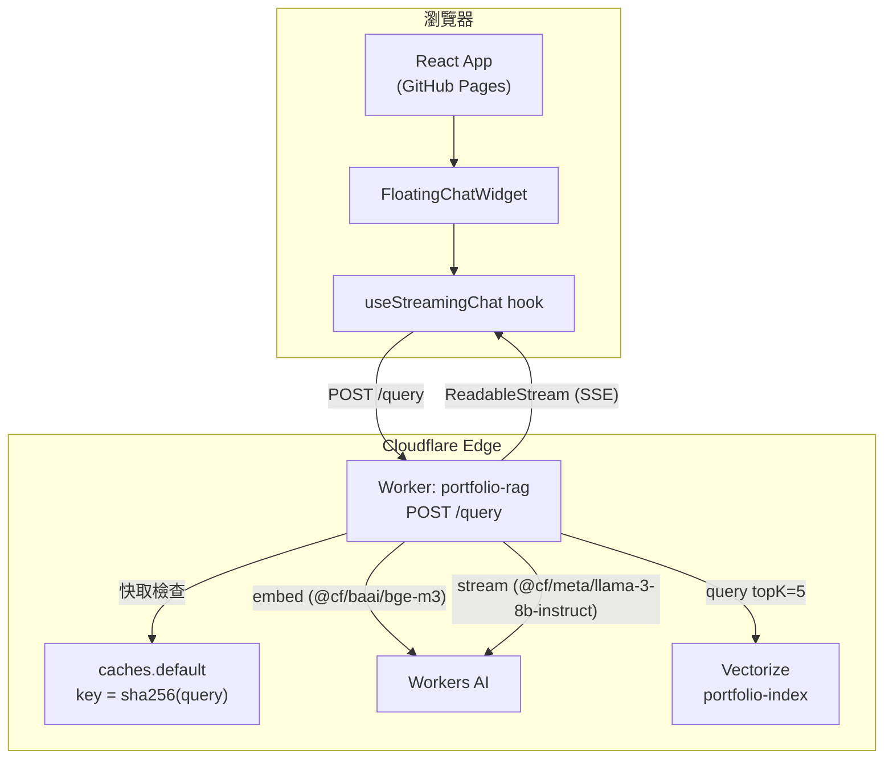
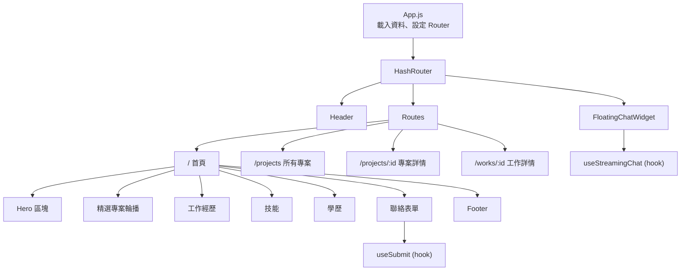
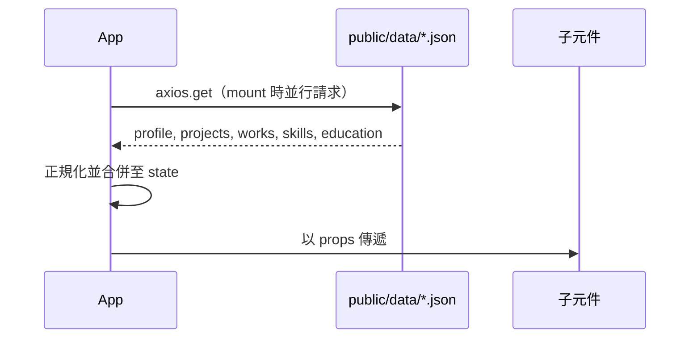
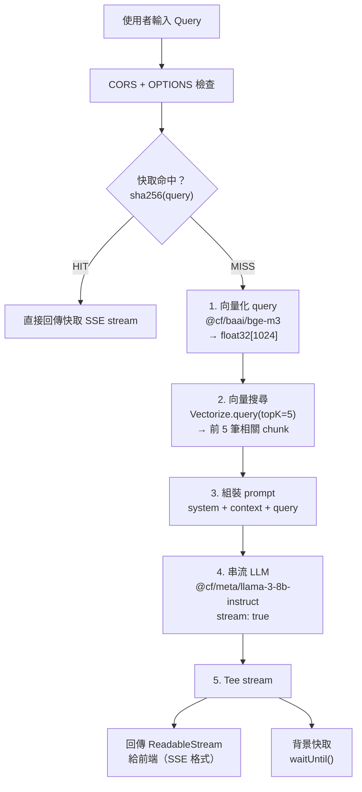
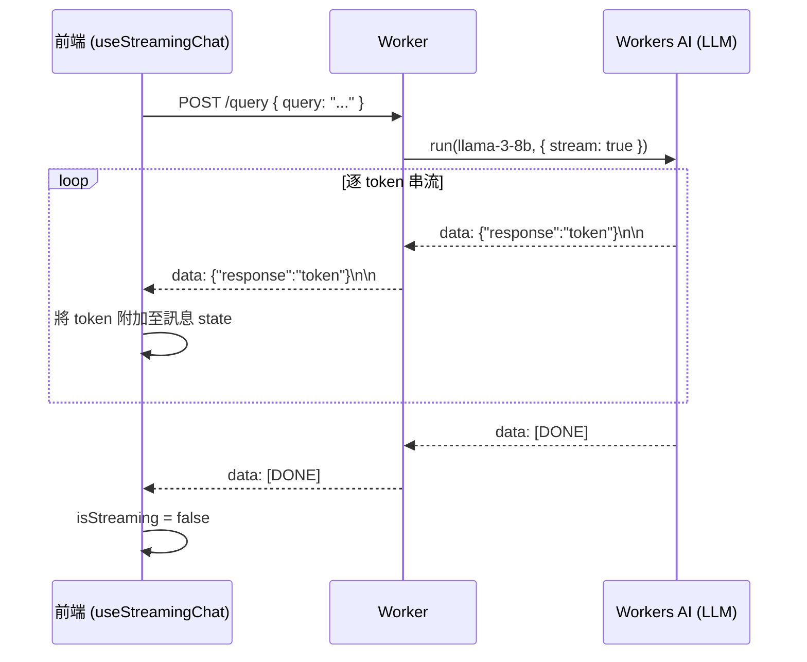
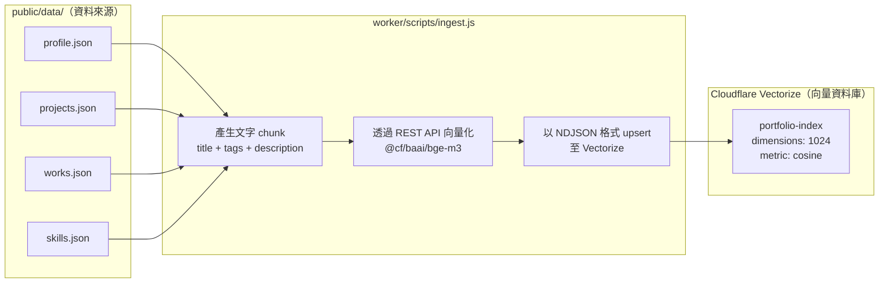
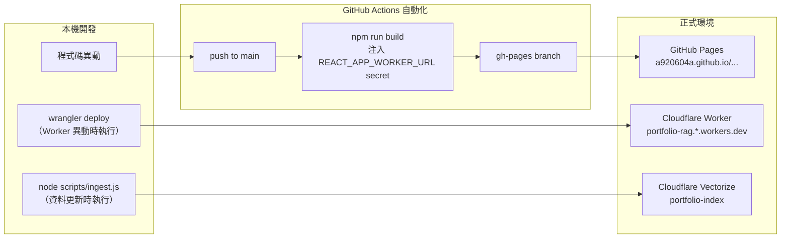

# 系統架構

## 總覽

本專案由兩個獨立部署的元件組成：部署在 GitHub Pages 的 React 靜態網站，以及在 Cloudflare Edge 執行 RAG + LLM 串流的 Cloudflare Worker。

---

## 前端架構

### 元件樹

### 資料流

### 路由規則

使用 `HashRouter`（`/#/` 形式），無需伺服器端路由設定，完全相容 GitHub Pages 靜態托管。

| 路徑 | 元件 |
|------|------|
| `/` | 主頁 |
| `/projects` | 所有專案格狀列表 |
| `/projects/:id` | 專案詳情頁 |
| `/works/:id` | 工作經歷詳情頁 |

---

## 後端架構（Cloudflare Worker）

### RAG Pipeline

### 串流協定

---

## 資料與 Vectorize

### Ingest Pipeline（首次設定 / 資料更新時手動執行）

### 向量 ID 命名規則

| 來源 | Vector ID |
|------|-----------|
| `projects.json` 各項目 | `project-{id}` |
| `works.json` 各項目 | `work-{id}` |
| `skills.json` | `skills` |
| `profile.json` | `profile` |

每個向量的 metadata 儲存 `{ text, type }`，供 Worker 在查詢時取出原始文字作為 context。

詳細同步流程請參閱 [RAG_SYNC_GUIDE.md](./RAG_SYNC_GUIDE.md)。

---

## 部署流程

### 環境變數

| 變數 | 使用位置 | 用途 |
|------|---------|------|
| `REACT_APP_WORKER_URL` | GitHub Secret + `.env` | Worker URL，在 build 時打包進 React |
| `CLOUDFLARE_API_TOKEN` | 本機 shell | ingest.js — 向量化 + upsert 到 Vectorize |
| `CLOUDFLARE_ACCOUNT_ID` | 本機 shell | ingest.js — Cloudflare REST API 呼叫 |

---

## 關鍵設計決策

**HashRouter 而非 BrowserRouter** — GitHub Pages 只提供單一 HTML 檔；hash 路由避免直接訪問子路徑時出現 404，無需伺服器端設定。

**Cloudflare Workers 而非傳統伺服器** — 零冷啟動延遲、全球邊緣分散式執行，Vectorize 與 Workers AI 同在 Cloudflare 平台，向量化與搜尋的網路往返延遲極低。

**SSE 而非 WebSocket** — LLM token 串流只需伺服器→客戶端單向推送；SSE 是 HTTP 原生協定，透過標準 `fetch()` + `ReadableStream` 即可使用，不需額外協定開銷。

**Stream tee 快取** — LLM stream 被 tee 成兩份：一份立即回傳給客戶端保持串流體驗，另一份在背景以 `waitUntil()` 存入 `caches.default`，cache miss 時不增加任何延遲。

**`public/data/*.json` 作為唯一資料來源** — 相同的 JSON 檔案同時驅動前端 UI 與 RAG 知識庫，不存在內容重複或 UI 與 AI 之間的同步落差。
